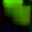
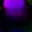
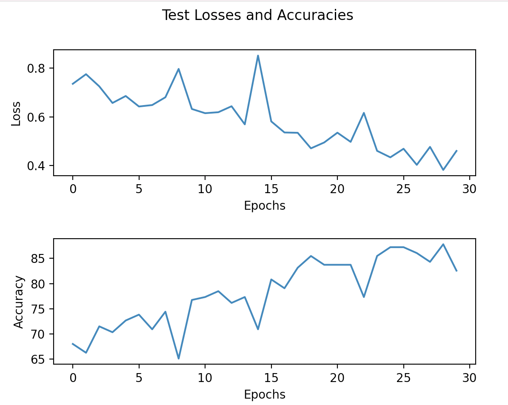

# Kettlebell-Swing-Counter

## Description
This is a program that can be used to count the number of kettlebell swings that are being performed. It uses the Dense Optical Flow Algorithm as well as a Convolutional Neural Network. I created the dataset myself by taking a video of myself performing kettlebell swings.

## Dataset
I created the dataset by taking a video of myself performing kettlebell swings. I then ran the video through a Dense Optical Flow Algorithm and condensed the frames to a size of 32 x 32. Each of the frames were labeled as either "UP", "DOWN", or "NOTHING".

## Dense Optical Flow
 A Dense Optical Flow algorithm from opencv was used to display the direction of motion of each frame.
 <br>
 <br>
 Green corresponded to an upwards swing.
 <br>
 Purple corresponded to a downwards swing.
 <br>
 An ambiguous color corresponded to a "nothing" swing.
 
 
 
 
 
 ```python optical_flow.py``` can be run to create the images from the kettlebell video.
 
 ## Convolutional Neural Network
 Pytorch was used to train a CNN to classify the dense optical flow images.
 <br>
 <br>
 ```python train.py``` can be run to train the model.
 
 
 
 ## Results
 With an accuracy of around 85%, I was able to use the CNN output to determine whether or not a kettlebell swing was completed. With regard to how this was done, I simply determined whether or not the upward motion of the kettlebell swing was completed by determining a minimum threshold for the upward motion. With the model that was trained, 8 was an adequate number. For a demo, refer to the video.
 
 ```python demo.py``` can also be run to view the demo.
 
 ## Demo Video
 
 [](https://youtu.be/X_aL2QOQwiw "Video Explanation")
 
 ## Resources:
 - https://www.geeksforgeeks.org/python-opencv-dense-optical-flow/
 - https://towardsdatascience.com/how-i-created-the-workout-movement-counting-app-using-deep-learning-and-optical-flow-89f9d2e087ac
 
